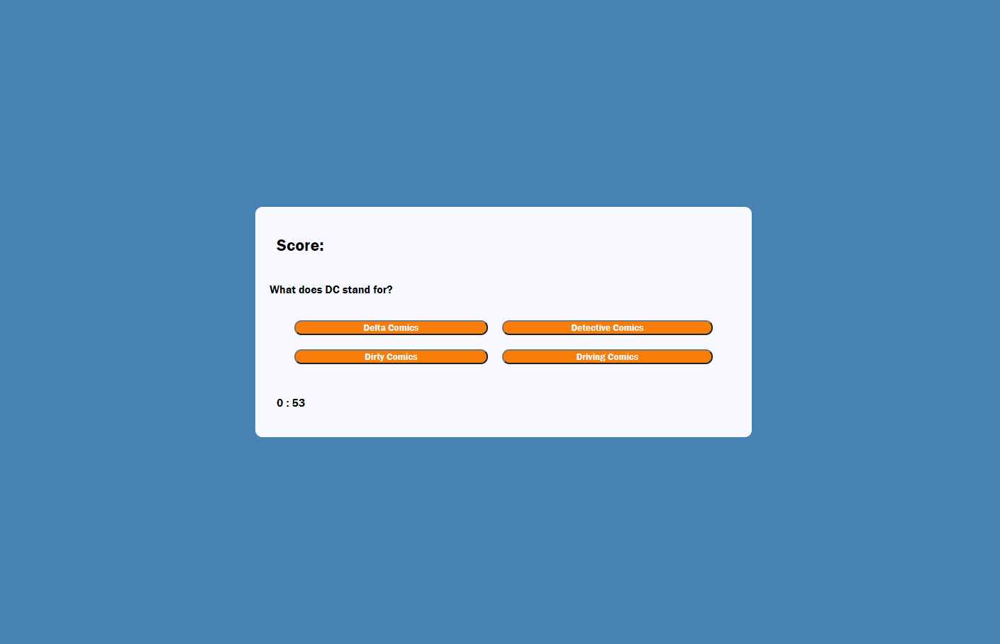

# -Week_four_homework

Quiz App

## Week four home work project

Our fourth week project was to creat a quiz app from scratch using HTML,CSS and JavaScript. We had to build everything and the quiz had certain needs that needed to be met. Multiple choice questions where a right answer would gain points where as an incorrect answer would deduct time. We needed to be able to set a timer, allow the player to submit a high score and have those scores save to local storage.

## This is the end result

## Where to access code

Week_four_homework git hub page.

## My contribution

This weeks project was one of the hardest things ive ever had to take part in. It was complicated, used advanced features for my skill level and was very frustrating at times.

In saying that, i learnt so much with this task. Im still not even close to confident in my javascript abilities but im much better than I was before the project started.

I chose to go with superhero themed questions as it is a big part of my life. I kept a simple but bold colour scheme and button layout and tried to make it very user friendly.

For this project, I did alot of external study. I read documentation and followed tutorials. I watched videos of other coders working on certain elements and i used office hours to their full extent. All this resulted into a code which for the most part works and something im particularly proud of.

**explaining my page**
I am very happy with my page but it is not without its faults. I had a few stumbles along the way and this hurt the end product. Almost all criteria has been met. The only part i just could not resolve and ran out of time with was having the highScoreList display back onto the screen. I began to work this out but did not have enough time to implement these changes.

For the most part, the page does what i wanted and most importantly, to me, it was a huge stepping stone in my skill level and taught me many valuable things.

Pass or fail, I will be coming back to this to fix up its short comings, improve the code and features and have a better understanding about what i created.

[click for page link] (https://jarred-caris.github.io/-Week_four_homework/.)
